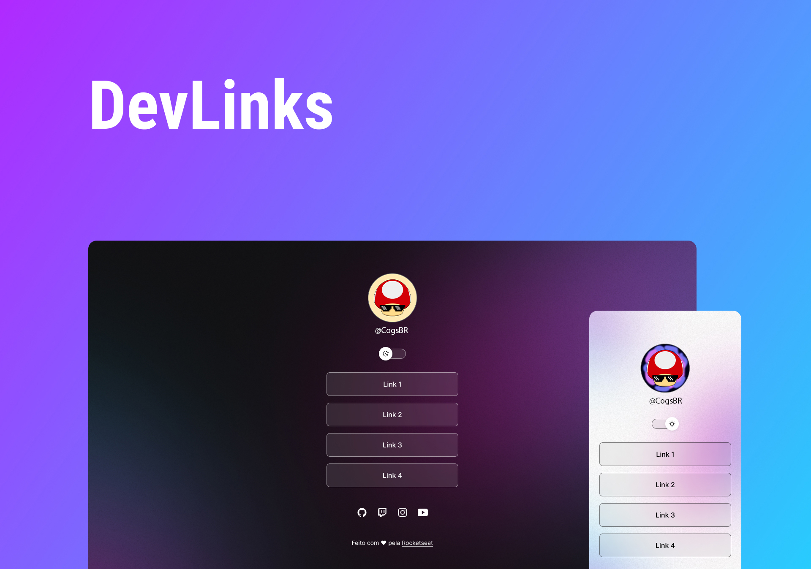

<h1 align="center"> Devlinks </h1>

Curso gratuíto de HTML e  CSS

  <a href="#-tecnologias">Tecnologias</a>&nbsp;&nbsp;&nbsp;|&nbsp;&nbsp;&nbsp;
  <a href="#-projeto">Projeto</a>&nbsp;&nbsp;&nbsp;|&nbsp;&nbsp;&nbsp;
  <a href="#-layout">Layout</a>&nbsp;&nbsp;&nbsp;

 

  

## 🚀 Tecnologias

Esse projeto foi desenvolvido com as seguintes tecnologias:

- HTML e CSS
- JavaScript
- Git e Github
- Figma

## 💻 Projeto

DevLinks é um projeto de cartão de visita usado como base no curso de HTML e CSS da Rocketseat 

## 🔖 Layout

Você pode visualizar o layout do projeto através [DESSE LINK](https://www.figma.com/file/wSLNnrcfvvH5Qf9dfs9m83/DevLinks-%E2%80%A2-Projeto-Discover-(Community)?type=design&node-id=1437-345&mode=design&t=HoE8mVB03jCJzF7J-0) para acessá-lo.

---

Feito com ♥ by Rocketseat :wave: [Participe da nossa comunidade!](https://discord.gg/rocketseat)
